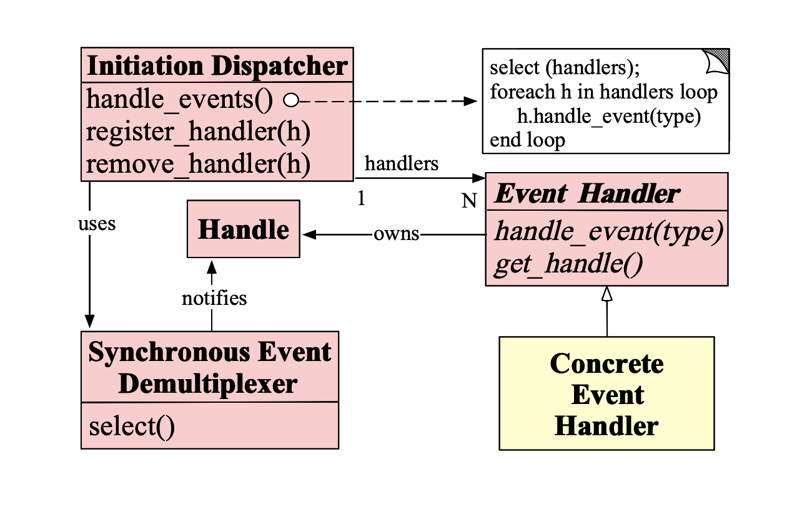

# Netty

### WebSocket实现与原理分析

### WebSocket连接建立方式与声明周期分解

### WebSocket服务端与客户端开发

### RPC框架分析

RPC：Remote Procedure Call，远程过程调用，很多RPC框架是跨语言的。

* 定义一个接口说明文件：描述了对象（结构体）、对象成员、接口方法等一系列信息；
* 通过RPC框架所提供的编译器，将接口说明文件编译成具体语言文件；
* 在客户端和与服务器端分别引入RPC编译器所生成的文件，即可像调用本地方法一样调用远程方法。

> Google Protocol Buffers 使用方式分析

```
protoc --java_out=src/main/java src/protobuf/Person.proto
```

> Apache Thrift 使用方式分析

```
thrift --gen java src/thrift/data.thrift
```

> gRPC 使用方式分析

基于 Protocol Buffers。

**Node示例的静态代码生成**

参考： https://github.com/grpc/grpc/tree/master/examples/node/static_codegen

使用protoc和Node gRPC protoc插件预先生成的，并且可以在各种* _pb.js文件中找到生成的代码。生成这些文件的命令行顺序如下（假定存在protoc和grpc_node_plugin）
```
npm install -g grpc-tools
grpc_tools_node_protoc --js_out=import_style=commonjs,binary:static_codegen/ --grpc_out=static_codegen/ --plugin=/opt/node-v12.16.1-linux-x64/bin/grpc_tools_node_protoc_plugin proto/Student.proto
```

> 装饰模式：

* 用来扩展特定对象的功能；
* 不需要子类；
* 动态；
* 运行时分配职责；
* 防止由于子类而导致的复杂和混乱；
* 更多的灵活性；
* 对于一个给定的对象，同时可能有不同的装饰对象，客户端可以通过它的需要选择合适的装饰对象发送消息。

> Reactor 模式的角色组成（Reactor模式一般由5种角色构成）



* Handle（具柄或是描述符）：本质上表示一种资源，是由操作系统提供的，该资源用于表示一个个的事件，
比如说文件描述符，或者针对网络编程中的Socket描述符。事件既可以来自于外部，也可以来自于内部；
外部事件比如说客户端的连接请求，客户端发送过来的数据等；内部事件比如说操作系统产生的定时器事件等。
它本质就是一个文件描述符，Handle是事件产生的发源地。
* Synchronous Event Demultiplexer（同步事件分离器）：它本身是一个系统调用，用于等待事件的发生（事件可能是一个事件，也可能是多个）；
调用方在调用它的时候会被阻塞，一直阻塞到同步事件分离器上有事件产生为止，
对于Linux来说，同步事件分离器指的就是常用的I/O多路复用的机制，比如说select、poll、epoll等；
在Java NIO领域中，同步事件分离器对应的组件就是Selector；对应的阻塞方法就是select方法。
* Event Handler（事件处理器）：本身由多个回调方法构成，这些回调方法构成了与应用相关的对于某个事件的反馈机制；
Netty相比Java NIO来说，在事件处理器这个角色上进行一个升级，它为我们开发者提供了大量的回调方法，供我们在特定事件产生时实现相应的回调方法进行业务逻辑的处理。
* Concrete Event Handler（具体事件处理器）：它是事件处理器的实现，它本身实现了事件处理器所提供的各个回调方法，从而实现特定业务的逻辑；
它本质上就是我们编写的一个个处理器的实现。
* Initiation Dispatcher（初始分发器）：它实际上就是Reactor角色。它本身定义了一些规范，这些规范用于控制事件的调度方式，
同时又提供了应用进行事件处理器的注册、删除等设施。它本身是整个事件的核心所在，Initiation Dispatcher会通过同步事件分离器来等待事件的发生。
一旦事件发生，Initiation Dispatcher首先会分离出每一个事件，然后调用事件处理器，最后调用相关的回调方法来处理这些事件。

> Reactor模式的流程

* 当应用向Initiation Dispatcher注册具体事件处理器时，应该会标识出该事件处理器希望Initiation Dispatcher在某个事件发生时向其通知的该事件，该事件与Handle关联。
* Initiation Dispatcher会要求每个事件处理器都向其传递内部的Handle，该Handle向操作系统标识了事件处理器。
* 当所有的事件处理器注册完毕后，应用会调用handler_event方法启动Initiation Dispatcher的事件循环。这时，Initiation Dispatcher会将每个注册的事件管理器的Handle合并起来。并使用同步事件分离器来等待这些事件的发生。
比如说，TCP协议层会使用select同步事件分离器操作来等待客户端发送的数据到达连接的socket handle上。
* 当与某个事件源对应的Handle变为ready状态时（比如说：TCP socket变为等待状态时），同步事件分离器就会通知Initiation Dispatcher。
* Initiation Dispatcher会触发事件处理器（Event Handler）的回调方法，从而响应这个ready状态的Handle。
当事件发生时，Initiation Dispatcher会将事件源激活的Handle做为【key】来寻找并分发恰当的事件处理器回调方法。
* Initiation Dispatcher会回调事件处理器的handler_event回调方法来执行特定于应用的功能（开发者自己编写的功能），从而响应这个事件。
所发生的事件类型可以作为该方法参数并被该方法内部使用来执行额外的特定于服务的分离和分发。

> EventLoop关联关系

1. 一个EventLoopGroup当中会包含一个或多个EventLoop。 
2. 一个EventLoop在它的整个生命周期当中都只会与唯一一个Thread进行绑定（SingleThreadEventExecutor）。
3. 所有由EventLoop所处理的各种I/O事件都将在它所关联的那个Thread上进行处理。
4. 一个Channel在它的整个生命周期中只会注册一个EventLoop上。
5. 一个EventLoop在运行过程当中，会被分配给一个或者多个Channel（一对多关联关系）。

**重要结论：在Netty中，Channel的实现一定是线程安全的；基于此，我们可以存储一个Channel的引用，并且在需要向远程端点发送数据时，通过这个引用来调用Channel相应的方法；
即便当时有很多线程都在使用它也不会出现线程问题；而且，消息一定会按照顺序发送出去。**

**重要结论：我们在业务开发中，不要将长时间执行的耗时任务放入到EventLoop的执行队列中，因为它将会一直阻塞该线程对应的所有Channel上其他执行任务，
如果我们需要进行阻塞调用或是耗时的操作（实际开发中很常见），那么我们就需要使用一个专门的EventExecutor（业务线程池）。**

> EventExecutor（业务线程池）通常两种实现方式：

1. 在ChannelHandler的回调方法中，使用自己定义的业务线程池，这样就可以实现异步调用。
2. 借助于Netty提供的向ChannelPipeline添加ChannelHandler时调用addLast方法来传递EvenExecutor。

说明：默认情况下（调用addLast(handler)），ChannelHandler中的回调方法都是有I/O线程执行，
如果调用了ChannelPipeline addLast(EventExecutorGroup group, ChannelHandler... handlers);方法，
那么ChannelHandler中的回调方法就是由参数中的group线程组来执行的。

**JDK提供的Future只能通过手工方式检查执行结果，而这个操作是会阻塞的；Netty则对ChannelFuture进行了增强，通过ChannelFutureListener以回调的方式来获取执行结果，去除了手工检查阻塞的操作；
值得注意的是：ChannelFutureListener的operationComplete方法是由I/O线程执行的，因此要注意的是不要在这里执行耗时操作，否则需要通过另外的线程或线程池来执行的。**

**在Netty中有两种发送消息的方式，可以直接写到Channel中，也可以写到与ChannelHandler所关联的那个ChannelHandlerContext中，对于前一种方式来说，消息会从
ChannelPipeline的【末尾】开始流动；对于后一种方式来说，消息将从ChannelPipeline中的【下一个】ChannelHandler开始流动。**

**结论：**
1. ChannelHandlerContext与ChannelHandler之间的关联绑定关系是永远不会发生改变的，因此对其进行缓存是没有任何问题的。
2. 对于与Channel的同名方法来说，ChannelHandlerContext的方法将会产生更短的事件流，所以我们应该在可能的情况下利用这个特性来提升应用性能。


**使用NIO进行文件读取所涉及的步骤**

1. 从FileInputStream对象获取到Channel对象；
2. 创建Buffer；
3. 将数据从Channel中读取到Buffer对象中（0 <= marks <= position <= limit <= capacity）。

在读与写切换时需要调用 flip() 方法【将limit设置当前position、将position设置为0】；

clear()方法【将limit设置为capacity、将position设置为0】；

compact()方法【将所有未读的数据复制到Buffer起始位置处、将position设置为最后一个未读元素的后面、将limit设置为capacity、现在Buffer就准备好了，但是不会覆盖未读的数据】；

注意：通过索引来访问Byte时并不会改变真实的读索引与写索引；我们可以通过ByteBuf的readerIndex()与writerIndex()方法分别直接修改读索引与写索引。

Netty ByteBuf所提供的3种缓冲区类型：

1. heap buffer
2. direct buffer
3. composite buffer

Heap Buffer（对缓冲区）

这是最常用的类型，ByteBuf将数据存储到JVM的对空间中，并且将实际的数据放到byte array中实现。

优点：由于数据是存储在JVM的堆中，因此可以快速的创建与快速的释放，并且它提供了直接的访问内部字节数组的方法
缺点：每次读写数据时，都需要先将数据复制到直接缓冲区中再进行网络传播

Direct Buffer（直接缓冲区）

在堆之外直接分配内存空间，直接缓冲区并不会占用堆的容量空间，因为它是由操作系统在本地内存进行的数据分配。

优点：在使用Socket进行数据传递时，性能非常好，因为数据直接位于操作系统的本地系统中，所以不需要从JVM将数据复制到直接缓冲区中，性能很好。
缺点：因为Direct Buffer是直接在操作系统内存中，所以内存空间的分配与释放要比对空间更加复杂，而且速度要慢一些。
Netty通过提供内存池来解决这个问题。直接缓冲区并不支持通过字节数组的方式访问数据。

**重点：对于后端的业务消息的编码来说，推荐使用HeapByteBuf；对于I/O通信线程在读写缓冲区时，推荐使用DirectByteBuf。**

Composite Buffer（复合缓冲区）

> JDK的ByteBuffer与Netty的ByteBuf之间的差异比对：

1. Netty的ByteBuf采用了读写索引分离的策略（readIndex与writeIndex），一个初始化（里面尚未有任何数据）的ByteBuf的readerIndex与writerIndex值都为0。
2. 当读索引和写索引处于同一个位置时，如果继续读取，那么就会抛出IndexOutOfBoundException。
3. 对于ByteBuf的任何读写的操作都会分别单独维护读索引和写索引。maxCapacity最大容量默认的限制就是Integer.MAX_VALUE。

* JDK的ByteBuffer的缺点：

1. final byte[] hb; 这是JDK的ByteBuffer对象中用于存储数据的对象声明；可以看到，其字节数组是被声明成final的，
也就是长度是固定不变的，一旦分配好后不能动态的扩容与收缩；而且当带存储的字节很大时就会有可能出现：IndexOutOfBoundException，如果出现这个异常，那就需要在存储之前完全确定好存储的字节大小。
如果ByteBuffer空间不足，我们只有一种解决方案：创建一个全新的ByteBuffer对象，然后再将之前的ByteBuffer中的数据复制过去，这一切操作都是需要由开发者自己手动完成。
2. ByteBuffer只使用一个position指针来标识位置信息，在进行读写切换时就需要调用flip方法或是rewind方法，使用起来很不方便。

* Netty的ByteBuf的优点：

1. 存储字节的数组是动态的，其最大默认是Integer.MAX_VALUE，这里的动态性具体体现在write方法中的，write方法在执行时会判断buffer容量，如果不足则自动扩容。
2. ByteBuffer的读写索引是完全分开的，使用起来很方便。

##### 自旋锁

AtomicIntegerFieldUpdater要点总结：

1. 更新器更新的必须是int类型变量，不能是其他包装类型。
2. 更新器更新的必须是volatile变量。volatile 防止指令重排序，确保证线程之间共享变量时的立即可见性。
3. 变量不能是static的，必须要是实例变量。因为Unsafe.objectFieldoffset()方法不支持静态变量（CAS操作本质上是通过对象实例的偏移量来直接进行赋值）。
4. 更新器只能修改它的可见范围内的变量，因为更新器是通过反射来得到这个变量，如果不可见就会报错。

如果更新变量就是包装类型，那么我们可以使用AtomicIntegerFieldUpdater来进行更新

> Netty处理器重要概念：

1. Netty处理器分为两类：入站处理器和出站处理器
2. 入站处理器的顶层是ChannelInboundHandler，出站处理器的顶层是ChannelOutboundHandler
3. 数据处理时常用的各种编码器本质上都是处理器
4. 编解码器：无论我们向网络中写入的数据是什么类型（int、char、String、二进制等），数据在网络传递时，其都是以字节流的形式呈现的；
将数据由原本的形式转换为字节流的操作成为编码（encode），将数据由字节转换为它原本的格式或是其他格式的操作称为解码（decode），编解码统一称为codec。
5. 编码：本质上是一种出站处理器；因此，编码一定是一种ChannelOutboundHandler
6. 解码：本质上是一种入站处理器；因此，解码一定是一种ChannelInboundHandler
7. 在Netty中，编码器通常以xxxEncoder命名；解码器通常以xxxDecoder命名

> 关于Netty编解码器的重要结论：

1. 无论是编码器还是解码器，其所接收的消息类型必须要与待处理的参数类型一致，否则该编码器或解码器并不会被执行。
2. 在解码器进行数据解码时，一定要判断缓冲(ByteBuf)中数据是否足够，否则将会产生一些问题。